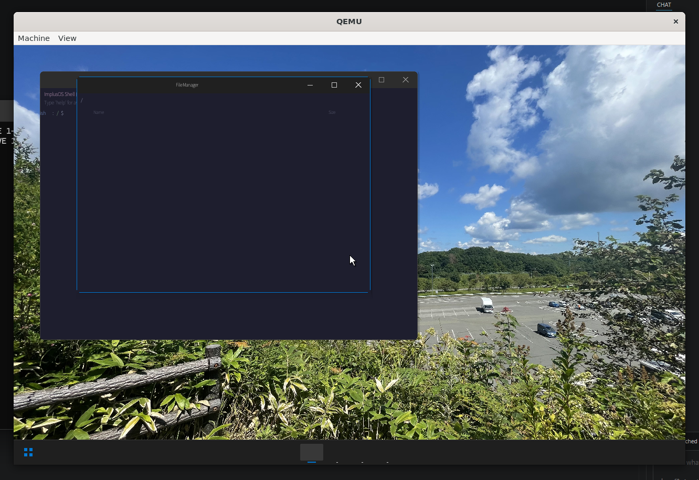
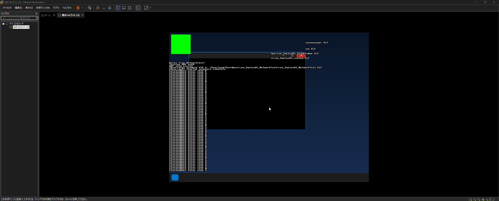

# ImplusOS

ImplusOS is a hobby operating system: a monolithic **x86-64 / arm64** kernel with
loadable driver modules, a UEFI (and legacy-BIOS, on x86-64) boot path, a minimal
freestanding C library, and a small graphical userland.

The default build target is **x86_64** (the architecture that is regularly booted
and tested in QEMU). Pass `ARCH=arm64` to build for **AArch64**; that port is
still in progress and its kernel link currently fails on a pre-existing
freestanding-libc issue (see `Docs/Others/TODO_OS_Refactor.md` §8).

Most of the code has been written with the help of AI coding tools.

<p>
  
  
</p>

[](https://opensource.org/licenses/MIT)

## Architecture at a Glance

| Component | Description |
|---|---|
| **Target** | x86-64 (Long Mode); arm64 (AArch64), in progress |
| **Boot** | UEFI via EDK2 (both arches) → boot manager → ELF64 kernel; legacy BIOS on x86-64 |
| **Kernel model** | Monolithic, with loadable driver modules (PIC ELF shared objects) |
| **Memory** | 4-level paging, bitmap PMM, kernel heap, DMA allocator, KASLR |
| **Filesystem** | Prefix-mounted VFS → FAT32 (read/write), exFAT (read-only), ISO9660 (read-only), plus DevFS/TmpFS/ProcFS/EtcFS |
| **Process model** | Per-process address space, capability-based, round-robin scheduling |
| **Syscall ABI** | x86_64 `SYSCALL`/`SYSRET`; arm64 `SVC`. Linux syscall-ABI compat layer for foreign binaries |
| **IPC** | Ring-buffer message queues (256 B/message, 128 messages/process); AF_UNIX sockets |
| **Display** | VirtIO-GPU and generic UEFI-GOP framebuffer, double-buffered |
| **Input** | PS/2 and USB HID (keyboard + mouse) |
| **Networking** | Ethernet / ARP / IPv4 / UDP / TCP / ICMP / DHCP (VirtIO-Net, Intel I219-V, AX900 Wi-Fi); userland DNS; TLS primitives in `Library/Crypto` |
| **Audio** | AC97, Intel HDA, VirtIO-Sound |
| **Hardening** | Kernel stack protector, `-fPIE` kernel, boot-time KASLR RNG |
| **Debug** | COM1 serial (115200), kernel `printf`, panic handler, 19-phase boot profiler |

```
┌──────────────────────────────────────────────────────────────┐
│                     Userland (Ring 3 / EL0)                   │
│  Init → services (POSIX, netstack) → WindowManager, sysnotif  │
├───────────────────────── SYSCALL / SVC ──────────────────────┤
│                     Kernel (Ring 0 / EL1)                     │
│  Process │ VFS (FAT32/exFAT/ISO9660/pseudo) │ IPC │ Network   │
│  ┌────────────────────────────────────────────────────────┐  │
│  │  Driver Module Manager (PIC ELF modules)               │  │
│  │  PCI · USB · Display · Input · NIC · Block · Audio · FS │  │
│  └────────────────────────────────────────────────────────┘  │
│  Memory/Paging │ GDT/IDT · EL vectors │ SMP │ ACPI/APIC/GIC   │
├──────────────────────────────────────────────────────────────┤
│   Boot Manager (UEFI / BIOS)  →  Loader shim  →  firmware     │
└──────────────────────────────────────────────────────────────┘
```

## Prerequisites

Host tools (Ubuntu/Debian; the build is meant for an interactive Linux shell):

```bash
sudo apt install -y build-essential nasm binutils parted \
  qemu-system-x86 qemu-system-arm dosfstools xorriso mtools util-linux gdb
```

Cross toolchains — the Makefile auto-detects the Homebrew prefix
(`/home/linuxbrew/.linuxbrew` on Linux, `/opt/homebrew` or `/usr/local` on macOS):

```bash
brew install x86_64-elf-gcc x86_64-elf-binutils
brew install aarch64-elf-gcc aarch64-elf-binutils   # only needed for ARCH=arm64
brew install lld gptfdisk
```

The UEFI EFI binaries are built with EDK2. Check it out once and build its
BaseTools:

```bash
git clone https://github.com/tianocore/edk2.git ~/edk2
cd ~/edk2 && git submodule update --init && make -C BaseTools
```

(Override the location with `EDK2_DIR=`; the Makefile drives EDK2 with the
`CLANGDWARF` toolchain.)

## Build & Run

```bash
make                     # full build for the default arch (x86_64)
make ARCH=arm64          # full build for AArch64

make image               # install-media hybrid ISO -> Image/ImplusOS-x86_64-InstallMedia.iso
make image_livecd        # LiveCD hybrid ISO        -> Image/ImplusOS-x86_64-LiveCD.iso

make run_uefi_usb        # boot the LiveCD in QEMU via UEFI, as a USB disk
make run_uefi_cdrom      # boot the LiveCD in QEMU via UEFI, as a CD-ROM
make run_bios_cdrom      # boot the LiveCD in QEMU via legacy BIOS (x86_64 only)

make clean
```

The `run_*` targets boot `Image/ImplusOS-$(ARCH)-LiveCD.iso`, so run
`make image_livecd` first. Other useful targets: `kernel`, `app_build`,
`service_build`, `driver_build`, `driver_stage`, `recovery_build`, `vendor_libs`,
`edk2_bootloader`, `edk2_bootmanager`.

> Building in non-interactive environments (CI containers, restricted sandboxes)
> may not work.

## Current Feature Set

- Dual-architecture kernel: **x86_64** (Long Mode) and **arm64** (AArch64,
  in progress), sharing one source tree via an `arch_ops_t` abstraction.
- UEFI boot for both arches (EDK2 loader + boot manager) plus a legacy-BIOS
  path on x86_64; boot-time KASLR.
- 19-phase instrumented boot sequence with a serial boot profiler.
- Process manager, per-process address spaces, capability-based security,
  round-robin preemptive scheduling.
- VFS with longest-prefix mounts: FAT32 (read/write), exFAT (read-only),
  ISO9660 (read-only), DevFS, TmpFS, ProcFS, EtcFS.
- Loadable PIC driver modules with runtime unload/reload:
  - Bus: PCI, USB (OHCI/UHCI/EHCI/XHCI) with HID and Mass Storage classes.
  - Block: AHCI, NVMe, VirtIO-Blk.
  - Display: VirtIO-GPU, generic UEFI-GOP framebuffer (double-buffered).
  - Input: PS/2 keyboard and mouse; USB HID.
  - NIC: VirtIO-Net, Intel I219-V, AX900 Wi-Fi (with firmware blob).
  - Audio: AC97, Intel HDA, VirtIO-Sound.
- Network stack: Ethernet, ARP, IPv4, UDP, TCP, ICMP, DHCP client; userland
  DNS resolver; a crypto library (`Library/Crypto`) with AES-GCM,
  ChaCha20-Poly1305, SHA-2, RSA, ECDSA/ECDHE, Ed25519, X25519, X.509
  verification and a TLS 1.3 record/key-schedule layer.
- IPC via ring-buffer message queues; AF_UNIX sockets.
- SMP (x86_64: APIC + AP trampoline; arm64: PSCI + GIC).
- NX paging, kernel `-fstack-protector-strong`, `-fPIE` kernel.
- Graphical userland: compositing window manager, notification daemon, BusyBox.
- Hot-loadable userland services: POSIX layer (`com.ImplusOS.posix`), DNS
  (`com.ImplusOS.netstack`), dynamic linker (`com.ImplusOS.ldso` +
  `com.ImplusOS.dynmain`).
- Linux syscall-ABI compatibility layer (`Kernel/Compat/Linux/`) for running
  `EI_OSABI == ELFOSABI_LINUX` binaries.
- Berkeley socket API, pthreads, and a large POSIX surface in userland.
- Helper userland libraries: FreeType, libjpeg, libpng/zlib, stb_truetype,
  stb_image, an XML parser for UI layouts.

## Current Constraints

- Verified operation is QEMU-centric (x86_64: OVMF; arm64: AAVMF). Physical
  hardware is not guaranteed.
- The **arm64** kernel does not currently link (`__trunctfdf2` undefined,
  from `vsnprintf`'s `long double` path — a pre-existing freestanding-libc
  bug, not arm64-specific logic).
- exFAT is **read-only**.
- No automated test suite is committed. `Docs/Architecture/CI_CD.md` describes
  intended GitHub Actions workflows; the `.github/` directory is not currently
  in the tree.

## Error and Status Contract

- Kernel subsystems return `os_status_t` (`Kernel/include/kernel/status.h`);
  negative values are errors.
- Userland wrappers expose `os_errno` with status-to-errno conversion.
- Some older VFS/driver APIs still return `bool`; the migration to `os_status_t`
  is incremental (`Docs/Others/TODO_OS_Refactor.md` §7).

## Documentation

- `Docs/Architecture/` — Kernel architecture, boot sequence, VFS & filesystems,
  driver module guide, network stack, compatibility layers, CI/CD.
- `Docs/Others/` — refactor plan and status, Linux-ABI / Chromium notes,
  release-note template.
- Guides for AI coding assistants: `CLAUDE.md`, `AGENTS.md`, `GEMINI.md`.
- API docs: `doxygen Doxyfile`.

## Repository Structure

```
ImplusOS/
├── BootLoader/          UEFI + BIOS first-stage loaders (x86_64/, arm64/)
├── BootManager/         Second-stage boot manager (Core/, UEFI/, BIOS/, BootManager_libc/)
├── Kernel/              Kernel source
│   ├── Arch/            x86_64/, arm64/ (cpu, hal, mmu, smp, timer, virt, interrupt)
│   ├── Compat/Linux/    Linux syscall-ABI compat layer
│   ├── Core/            kernel_main + process, vfs, syscall, elf, timer, sync,
│   │                    memory, usercopy, hardening, drm, kvm, sysinfo
│   ├── Debug/           serial, printf, panic
│   ├── Drivers/         Loadable driver modules + kernel-resident glue (Module/)
│   ├── IPC/             Message queues + AF_UNIX
│   ├── MemoryManagement/ PMM, heap, DMA
│   ├── Network/         Ethernet/ARP/IPv4/UDP/TCP/ICMP/DHCP
│   ├── Platform/        ACPI, interrupt controllers, I/O protocols, timer
│   ├── config/arch.mk   Per-architecture flags
│   └── include/          Shared headers (arch_ops.h, status.h, config.h, ...)
├── Library/            Shared crypto / Unicode / UUID source, built into kernel + userland
├── Userland/           Init, API wrappers, applications, hot-loadable services
├── libc/I_libc/        Minimal freestanding C library
├── RecoveryEnvironment/ Minimal init for the install media
├── Vendor/             Header/ (stb) + Library/ submodules (libpng, zlib, libjpeg, freetype)
├── Docs/               Documentation and images
├── Makefile            Top-level build orchestrator
└── Doxyfile
```

## License

MIT — see `LICENSE`. Third-party components under `Vendor/` keep their own
licenses; see `Docs/OSS_License/`.
